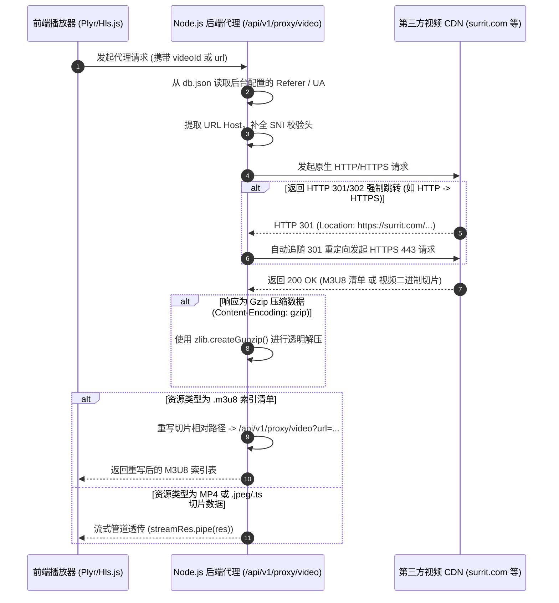

# 音视频防盗链代理拉流与前端内存 Blob 播放技术架构文档

> **编写目的**：本文档用于详细记载项目中“后端代理拉流突破防盗链 (含 HTTP 301 跳转/Cloudflare WAF 穿透/Gzip 解压)”与“前端内存流转 Blob URL 播放”的完整技术架构、实现原理及踩坑解决方案，供后续维护与迭代参阅。

---

## 1. 架构背景与业务痛点

在音视频业务中，直接使用 HTML5 `<video src="第三方视频地址">` 常面临以下严重瓶颈：

1. **跨域 (CORS) 限制**：第三方 CDN 节点未配置 `Access-Control-Allow-Origin: *`。
2. **防盗链校验 (Referer / User-Agent 校验)**：浏览器出于安全策略，无法在前端 `fetch` 或 `<video>` 请求中自由伪造 `Referer` 或非标准的 `User-Agent`。
3. **Cloudflare WAF 防火墙拦截**：第三方视频源挂载了 Cloudflare 防火墙，缺少合规请求头或 TLS 手势匹配时会返回 `403 Forbidden`。
4. **HLS M3U8 相对路径切片失效**：.m3u8 视频清单中的切片文件名（如 `video1.ts` 或 `video1.jpeg`）基于第三方 CDN 相对路径，前端直连无法正常拼接。

为解决上述问题，本项目设计并实现了**“后端代理中转重写 + 前端内存流 Blob 渲染”**的端到端播放架构。

---

## 2. 核心一：后端代理拉流与 301/302 重定向架构

### 2.1 架构流程图



---

### 2.2 核心技术要点

#### ① 解决 HTTP 301/302 自动追随跳转

* **痛点**：Node.js 原生 `http` / `https` 模块在请求 `http://` 域名时，若第三方 CDN 强制重定向至 `https://`，默认**不会**像 `curl -L` 或浏览器那样自动跳转，而是返回 167 字节的 301 HTML 页面，导致 M3U8 解析器报 `non-M3U8 data` 错误。
* **解决方案**：在 `fetchM3u8Playlist` 和 `proxyDirectUrl` 中实现了递归式 3xx 追踪逻辑：

```javascript
// 自动追随 3xx 301/302 跳转
if (streamRes.statusCode >= 300 && streamRes.statusCode < 400 && streamRes.headers.location) {
  const redirectUrl = streamRes.headers.location.startsWith('http')
    ? streamRes.headers.location
    : new URL(streamRes.headers.location, cleanUrl).href
  
  logger.info(`[HLS M3U8 Proxy] Following ${streamRes.statusCode} redirect to: ${redirectUrl}`)
  return fetchM3u8Playlist(redirectUrl, customHeaders, req, res, redirectCount + 1)
}
```

---

#### ② 请求头拟真与 Cloudflare WAF 穿透

1. **Host 字段自动对齐**：必须显式设置 `Host: <targetDomain>`（由 `new URL(cleanUrl).host` 动态提取），防止 Cloudflare SNI 证书与 Host 头不匹配触发 403。
2. **严格透传管理后台配置**：管理后台可为视频自由配置 `Referer` 与 `User-Agent`，后端在 `normalizeHeaders()` 中解析后完全透传给目标服务器。

```javascript
const urlObj = new URL(cleanUrl)
const finalHeaders = {
  'Host': urlObj.host,
  'Accept': 'text/html,application/xhtml+xml,application/xml;q=0.9,*/*;q=0.8',
  'Accept-Language': 'en-US,en;q=0.9',
  'Accept-Encoding': 'gzip, deflate, br',
  ...customHeaders
}
```

---

#### ③ 透明 Gzip / Brotli 解压

* **痛点**：部分 CDN 节点开启了 Gzip 压缩。若 Node.js 将接收到的 gzip 二进制数据直接当作 UTF-8 文本解析，会导致 `m3u8Data.includes('#EXTM3U')` 判断失败。
* **解决方案**：利用 Node.js 原生 `zlib` 模块对管道流进行透明解包：

```javascript
import zlib from 'zlib'

let responseStream = streamRes
const encoding = streamRes.headers['content-encoding']

if (encoding === 'gzip') {
  responseStream = streamRes.pipe(zlib.createGunzip())
} else if (encoding === 'deflate') {
  responseStream = streamRes.pipe(zlib.createInflate())
} else if (encoding === 'br') {
  responseStream = streamRes.pipe(zlib.createBrotliDecompress())
}

let m3u8Data = ''
responseStream.on('data', chunk => m3u8Data += chunk.toString('utf8'))
```

---

#### ④ M3U8 相对路径递归重写

读取解压后的 M3U8 文本后，逐行过滤将相对路径切片转换为经过后端中转代理的虚拟地址：

```javascript
const lines = m3u8Data.split('\n')
const rewritten = lines.map(line => {
  const trimmed = line.trim()
  if (!trimmed || trimmed.startsWith('#')) return line
  const segUrl = trimmed.startsWith('http') ? trimmed : (baseUrl + trimmed)
  return `/api/v1/proxy/video?id=${req.query.id || ''}&url=${encodeURIComponent(segUrl)}`
}).join('\n')
```

---

## 3. 核心二：前端内存流转 Blob URL 播放架构

前端核心组件：[MemoryVideoPlayer.vue](file:///c:/Users/Ryu/Documents/mobile-paywall/mobile-paywall/packages/client/src/components/MemoryVideoPlayer.vue)

### 3.1 内存 Blob 生成五步法

前端接收 MP4 直连流时，通过下述 5 步在客户端内存中完成字节拉取与 Blob 组装：

1. **Step 1: 发起 Fetch**
   使用带有中转 URL 的 `fetch('/api/v1/proxy/video?url=...')` 发起网络请求。
2. **Step 2: 分块读取 Stream (ReadableStream)**
   获取 `response.body.getReader()`，分段读取 `Uint8Array` 字节块，并根据 `Content-Length` 计算百分比加载进度条：
   ```typescript
   const { done, value } = await reader.read()
   chunks.push(value)
   receivedBytes += value.length
   progress.value = Math.min(100, (receivedBytes / totalBytes) * 100)
   ```
3. **Step 3: 封装 Blob 实体**
   ```typescript
   const videoBlob = new Blob(chunks, { type: contentType })
   ```
4. **Step 4: 生成 RAM 虚拟句柄 (URL.createObjectURL)**
   ```typescript
   activeObjectUrl = URL.createObjectURL(videoBlob)
   // 生成如 "blob:http://localhost:5173/4b547ec6-0c09-478a-a4d1-4bd36d309f0a"
   ```
5. **Step 5: 挂载 HTML5 `<video>` & 初始化 Plyr 播放器**
   ```typescript
   videoRef.value.src = activeObjectUrl
   plyrInstance = new Plyr(videoRef.value, { ... })
   ```

---

### 3.2 内存泄漏防范与 `net::ERR_FILE_NOT_FOUND` 解决方案

#### 💥 常见崩溃陷阱
若在切换视频或销毁组件时直接同步调用 `URL.revokeObjectURL(url)`，会触发浏览器底层的**竞争条件 (Race Condition)**：Chrome 媒体解码器在异步建立解码 Buffer 时会突然发现该内存地址被擦除，从而在控制台爆出 `net::ERR_FILE_NOT_FOUND` 错误。

#### 🛡️ 解决方案：带 1.5 秒缓冲期的安全注销机制

```typescript
const safeRevokeObjectUrl = () => {
  if (activeObjectUrl) {
    const urlToRevoke = activeObjectUrl
    activeObjectUrl = null

    // 1. 同步切断 DOM 节点对旧 Blob 的引用并重置解码器
    if (videoRef.value && videoRef.value.src === urlToRevoke) {
      videoRef.value.removeAttribute('src')
      try {
        videoRef.value.load()
      } catch (e) {
        // ignore
      }
    }

    // 2. 给予 Chrome 媒体解码器 1.5 秒缓冲期，确保 Buffer 完成建立后再释放 RAM
    setTimeout(() => {
      console.log(`[MemoryVideoPlayer Debug] 🗑️ Safely revoked Blob URL from RAM: ${urlToRevoke}`)
      URL.revokeObjectURL(urlToRevoke)
    }, 1500)
  }
}
```

---

### 3.3 Surrit 精灵图进度条悬停预览架构与 10x10 网格切片渲染

对于来源于 `surrit.com` 上游节点的视频，前端组件自动识别 `surrit.com/{video-uuid}/` 路径，计算对应切片的 Seek 精灵图地址及 10x10 网格帧切片坐标：

```typescript
// 1. 精灵图计算公式 (每 300 秒覆盖一张图)
const spriteIndex = Math.floor(timeSeconds / 300) + 1
const rawSpriteUrl = `https://surrit.com/${surritUuid}/seek/_${spriteIndex}.jpg`

// 2. 10x10 网格切片计算 (每张大图 100 帧，每帧 3 秒)
const timeInSprite = timeSeconds - (spriteIndex - 1) * 300
const tileIndex = Math.min(99, Math.max(0, Math.floor(timeInSprite / 3)))
const col = tileIndex % 10
const row = Math.floor(tileIndex / 10)

// 3. CSS background-position 步长百分比 (0% ~ 100% 对应 9 个步进间距)
const posX = (col / 9) * 100
const posY = (row / 9) * 100

// 4. 必须通过后端代理拉取，且传递与视频主请求完全一致的 Referer 与 User-Agent
let proxiedSprite = `/api/v1/proxy/video?id=${props.video.id || ''}&url=${encodeURIComponent(rawSpriteUrl)}`
if (hasHeaders) {
  proxiedSprite += `&headers=${encodeURIComponent(JSON.stringify(customHeaders))}`
}
```

后端接口接收到 `id` 或 `headers` 后，会自动从 `db.json` 读取该视频的防盗链请求头，确保拉取 `seek/_{index}.jpg` 精灵图时与视频切片使用**完全一致的请求头**；前端通过 CSS `background-size: 1000% 1000%` 与 `background-position` 精准截取并渲染单一预览帧！

---

## 4. 常见排错与 Troubleshooting 指南

| 异常现象 | 诊断原因 | 排查步骤 / 解决办法 |
| :--- | :--- | :--- |
| `Upstream returned non-M3U8 data` | 后端拿到的不是 `#EXTM3U` 文本（拿到的是 301 页面或 Cloudflare 403 HTML） | 1. 确认 URL 是否缺少 `https://`<br>2. 检查 `fetchM3u8Playlist` 是否正确追随了 301 跳转<br>3. 检查响应头是否带有 `gzip` 编码未解压 |
| `Proxy upstream returned HTTP 403` | 第三方 CDN 防火墙拦截了请求 | 1. 检查管理后台设置的 `Referer` 是否正确<br>2. 检查 User-Agent 字符串是否合法<br>3. 确认后端的 `Host` 头部是否与目标域名一致 |
| `XHR failed loading / timeout` | `hls.js` 20 秒默认超时触发主动挂断 | 在 `new Hls({ manifestLoadingTimeOut: 60000 })` 中将超时时间扩容至 60 秒 |
| `net::ERR_FILE_NOT_FOUND (blob:http...)` | Blob URL 被 prematurely 提前注销 | 确保使用 `safeRevokeObjectUrl()` 中的 1.5 秒 `setTimeout` 延迟释放内存 |

---

**文档维护时间**：2026-07-30  
**适用模块**：`packages/server/src/index.js`, `packages/client/src/components/MemoryVideoPlayer.vue`
